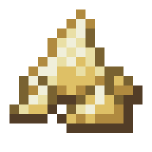
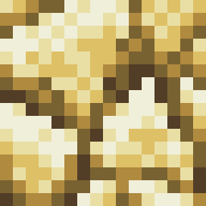
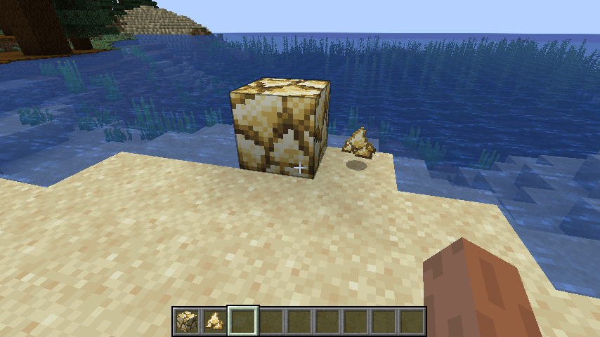

# 方块和物品

Minecraft 中不同的方块类型或物品类型对应不同的实例：方块类型对应 `Block` 类，物品类型对应 `Item` 类。开发者可直接使用这两个类构造方块类型或物品类型，也可继承它们，实现自己的方块类或物品类。

一个值得注意的物品类是 `BlockItem` 类：它是 `Item` 的子类，用于代表方块对应的物品。`BlockItem` 实现了作为方块的物品需要实现的特性——右键放置方块，因此在声明 `Block` 时通常会一并声明其对应的 `BlockItem`。

## 方块和物品属性

`Block` 和 `Item` 的构造方法均需传入相应的 `Properties`（方块是 `BlockBehavior.Properties`，物品是 `Item.Properties`）。方块的 `Properties` 需要指定方块的[材料](https://minecraft.fandom.com/zh/wiki/%E6%9D%90%E6%96%99)——方块的核心属性。方块的 `Properties` 有一些额外的方法可以指定方块本身的[硬度](https://minecraft.fandom.com/zh/wiki/%E6%8C%96%E6%8E%98#.E6.96.B9.E5.9D.97.E7.A1.AC.E5.BA.A6)及[爆炸抗性](https://minecraft.fandom.com/zh/wiki/%E7%88%86%E7%82%B8#.E7.88.86.E7.82.B8.E6.8A.97.E6.80.A7)（`strength`）、是否可徒手破坏掉落（`requiresCorrectToolForDrops`）、亮度（`lightLevel`）等。物品的 `Properties` 有一些额外方法可以指定物品的创造模式物品栏（`tab`）、最大堆叠（`stacksTo`）、合成后剩余的物品（`craftRemainder`）等。

```java
// 一个创造模式物品栏为「杂项」的物品
var item = new Item(new Item.Properties().tab(CreativeModeTab.TAB_MISC));
// 一个材料为「石头」，需要特定工具挖掘掉落，且方块硬度为 2，爆炸抗性为 1.5 的方块
var block = new Block(BlockBehaviour.Properties.of(Material.STONE).requiresCorrectToolForDrops().strength(2F, 1.5F));
// 一个创造模式物品栏为「建筑方块」，且与上述方块对应的物品
var blockItem = new BlockItem(block, new Item.Properties().tab(CreativeModeTab.TAB_BUILDING_BLOCKS));
```

:::tip

可以通过查看 `Blocks` 及 `Items` 类（注意类名最后的 `s`）了解原版方块及物品的相关属性。

:::

## 注册系统

无论是方块还是物品均被 Forge 的注册系统托管。Forge 为多种游戏元素托管了注册系统，它们均可在 `ForgeRegistries` 下找到：方块的注册系统对应 `ForgeRegistries.BLOCKS`，而物品的注册系统对应 `ForgeRegistries.ITEMS`。

Forge 为我们提供了 `DeferredRegister` 方便我们向 Forge 的注册系统注册游戏元素：

```java
// 为 xiaozhong 命名空间注册物品
public static final DeferredRegister<Item> ITEMS = DeferredRegister.create(ForgeRegistries.ITEMS, "xiaozhong");
```

`DeferredRegister` 有两个名为 `register` 的重载方法。一个需传入游戏元素的 ID 和相应的 `Supplier`，用于注册相应的实例：

```java
// 注册 xiaozhong:sulfur_dust 对应的物品
public static final String SULFUR_DUST_ID = "sulfur_dust";
public static final RegistryObject<Item> SULFUR_DUST_ITEM = ITEMS.register(SULFUR_DUST_ID, () -> new Item(new Item.Properties().tab(CreativeModeTab.TAB_MISC)));
```

:::info

`RegistryObject` 储存着游戏元素的实例——该实例可通过 `get` 方法获得。建议将物品和方块对应的 `RegistryObject` 以静态字段的方式声明。

:::

`DeferredRegister` 的另一个 `register` 方法需传入 `IEventBus`，用于完成具体的注册（通常在主类的构造方法调用）：

```java
// 注册所有物品
ITEMS.register(FMLJavaModLoadingContext.get().getModEventBus());
```

:::info

将 `IEventBus` 传入 `register` 方法本质上是为注册事件添加监听器——相应的注册事件触发后整个注册流程才会完成。

:::

以下演示了仅包含方块和物品本身的最基础的注册流程——没有相应的语言文件，没有模型，什么都没有：

```java
package org.teacon.xiaozhong;

import net.minecraft.world.item.BlockItem;
import net.minecraft.world.item.CreativeModeTab;
import net.minecraft.world.item.Item;
import net.minecraft.world.level.block.Block;
import net.minecraft.world.level.block.state.BlockBehaviour;
import net.minecraft.world.level.material.Material;
import net.minecraftforge.fml.common.Mod;
import net.minecraftforge.fml.javafmlmod.FMLJavaModLoadingContext;
import net.minecraftforge.registries.DeferredRegister;
import net.minecraftforge.registries.ForgeRegistries;
import net.minecraftforge.registries.RegistryObject;

@Mod("xiaozhong")
public class Xiaozhong {
    // 为 xiaozhong 命名空间注册物品
    public static final DeferredRegister<Item> ITEMS = DeferredRegister.create(ForgeRegistries.ITEMS, "xiaozhong");
    // 为 xiaozhong 命名空间注册方块
    public static final DeferredRegister<Block> BLOCKS = DeferredRegister.create(ForgeRegistries.BLOCKS, "xiaozhong");

    // 注册 xiaozhong:sulfur_dust 对应的物品
    public static final String SULFUR_DUST_ID = "sulfur_dust";
    public static final RegistryObject<Item> SULFUR_DUST_ITEM = ITEMS.register(SULFUR_DUST_ID,
            () -> new Item(new Item.Properties().tab(CreativeModeTab.TAB_MISC)));

    // 注册 xiaozhong:sulfur_block 对应的方块和物品，注意 BlockItem 的注册
    public static final String SULFUR_BLOCK_ID = "sulfur_block";
    public static final RegistryObject<Block> SULFUR_BLOCK = BLOCKS.register(SULFUR_BLOCK_ID,
            () -> new Block(BlockBehaviour.Properties.of(Material.STONE).requiresCorrectToolForDrops().strength(2F, 1.5F)));
    public static final RegistryObject<BlockItem> SULFUR_BLOCK_ITEM = ITEMS.register(SULFUR_BLOCK_ID,
            () -> new BlockItem(SULFUR_BLOCK.get(), new Item.Properties().tab(CreativeModeTab.TAB_BUILDING_BLOCKS)));

    public Xiaozhong() {
        // 注册所有物品
        ITEMS.register(FMLJavaModLoadingContext.get().getModEventBus());
        // 注册所有方块
        BLOCKS.register(FMLJavaModLoadingContext.get().getModEventBus());
    }
}
```

:::tip

在游戏中使用 `/give @s [模组 ID]:[物品 ID]` 即可拿到物品，如使用 `/give @s xiaozhong:sulfur_dust` 和 `/give @s xiaozhong:sulfur_block` 等。

:::

## 语言文件

仅需在 `LanguageProvider` 的 `add` 方法传入对应的 `Block` 或 `Item` 实例即可。Minecraft 会自动读取对应的翻译标识符。

以下为示例：

```java
package org.teacon.xiaozhong;

import net.minecraft.data.DataGenerator;
import net.minecraft.world.item.BlockItem;
import net.minecraft.world.item.CreativeModeTab;
import net.minecraft.world.item.Item;
import net.minecraft.world.level.block.Block;
import net.minecraft.world.level.block.state.BlockBehaviour;
import net.minecraft.world.level.material.Material;
import net.minecraftforge.common.data.LanguageProvider;
import net.minecraftforge.fml.common.Mod;
import net.minecraftforge.fml.javafmlmod.FMLJavaModLoadingContext;
import net.minecraftforge.forge.event.lifecycle.GatherDataEvent;
import net.minecraftforge.registries.DeferredRegister;
import net.minecraftforge.registries.ForgeRegistries;
import net.minecraftforge.registries.RegistryObject;

@Mod("xiaozhong")
public class Xiaozhong {
    public static final DeferredRegister<Item> ITEMS = DeferredRegister.create(ForgeRegistries.ITEMS, "xiaozhong");
    public static final DeferredRegister<Block> BLOCKS = DeferredRegister.create(ForgeRegistries.BLOCKS, "xiaozhong");

    public static final String SULFUR_DUST_ID = "sulfur_dust";
    public static final RegistryObject<Item> SULFUR_DUST_ITEM = ITEMS.register(SULFUR_DUST_ID,
            () -> new Item(new Item.Properties().tab(CreativeModeTab.TAB_MISC)));

    public static final String SULFUR_BLOCK_ID = "sulfur_block";
    public static final RegistryObject<Block> SULFUR_BLOCK = BLOCKS.register(SULFUR_BLOCK_ID,
            () -> new Block(BlockBehaviour.Properties.of(Material.STONE).requiresCorrectToolForDrops().strength(2F, 1.5F)));
    public static final RegistryObject<BlockItem> SULFUR_BLOCK_ITEM = ITEMS.register(SULFUR_BLOCK_ID,
            () -> new BlockItem(SULFUR_BLOCK.get(), new Item.Properties().tab(CreativeModeTab.TAB_BUILDING_BLOCKS)));

    public Xiaozhong() {
        ITEMS.register(FMLJavaModLoadingContext.get().getModEventBus());
        BLOCKS.register(FMLJavaModLoadingContext.get().getModEventBus());
        // 向 Data Generator 添加 DataProvider
        FMLJavaModLoadingContext.get().getModEventBus().addListener(Xiaozhong::onGatherData);
    }

    public static void onGatherData(GatherDataEvent event) {
        var gen = event.getGenerator();
        // 添加语言文件的 DataProvider
        gen.addProvider(new EnglishLanguageProvider(gen));
        gen.addProvider(new ChineseLanguageProvider(gen));
    }

    // 英文语言文件
    public static class EnglishLanguageProvider extends LanguageProvider {
        public EnglishLanguageProvider(DataGenerator gen) {
            super(gen, "xiaozhong", "en_us");
        }

        @Override
        protected void addTranslations() {
            // 等价于 this.add("item.xiaozhong.sulfur_dust", "Sulfur Dust")
            this.add(SULFUR_DUST_ITEM.get(), "Sulfur Dust");
            // 等价于 this.add("block.xiaozhong.sulfur_block", "Sulfur Block")
            this.add(SULFUR_BLOCK.get(), "Sulfur Block");
        }
    }

    // 中文语言文件
    public static class ChineseLanguageProvider extends LanguageProvider {
        public ChineseLanguageProvider(DataGenerator gen) {
            super(gen, "xiaozhong", "zh_cn");
        }

        @Override
        protected void addTranslations() {
            // 等价于 this.add("item.xiaozhong.sulfur_dust", "硫粉")
            this.add(SULFUR_DUST_ITEM.get(), "硫粉");
            // 等价于 this.add("block.xiaozhong.sulfur_block", "硫磺块")
            this.add(SULFUR_BLOCK.get(), "硫磺块");
        }
    }
}
```

## 模型文件

物品模型通常直接和物品 ID 关联，由位于 `[模组 ID]:item/[物品 ID]` 处的模型文件定义。但对方块模型而言，由于方块存在不同的[方块状态](https://minecraft.fandom.com/zh/wiki/%E6%96%B9%E5%9D%97%E7%8A%B6%E6%80%81)，因此需要在 `[模组 ID]:[方块 ID]` 处声明对应的方块状态文件，再在方块状态文件里声明模型位置。

幸运的是，无论是模型文件还是方块状态文件均可使用 Data Generator 生成。唯一不能生成的只有纹理——模组开发者需要把纹理放到 `src/main/resources` 下相应的位置。

:::tip

对于常用的方块模型，Data Generator 提供了非常多的预设。当然，模组开发者也可以制作自己的丰富多彩的模型。对 Minecraft 而言，常见的模型制作工具有 Blockbench 等。Blockbench 可在 https://www.blockbench.net/ 下载。

:::

此处展示如何生成最简单的方块模型及物品模型：

```java
package org.teacon.xiaozhong;

import net.minecraft.data.DataGenerator;
import net.minecraft.resources.ResourceLocation;
import net.minecraft.world.item.BlockItem;
import net.minecraft.world.item.CreativeModeTab;
import net.minecraft.world.item.Item;
import net.minecraft.world.level.block.Block;
import net.minecraft.world.level.block.state.BlockBehaviour;
import net.minecraft.world.level.material.Material;
import net.minecraftforge.client.model.generators.BlockStateProvider;
import net.minecraftforge.client.model.generators.ItemModelProvider;
import net.minecraftforge.common.data.ExistingFileHelper;
import net.minecraftforge.common.data.LanguageProvider;
import net.minecraftforge.fml.common.Mod;
import net.minecraftforge.fml.javafmlmod.FMLJavaModLoadingContext;
import net.minecraftforge.forge.event.lifecycle.GatherDataEvent;
import net.minecraftforge.registries.DeferredRegister;
import net.minecraftforge.registries.ForgeRegistries;
import net.minecraftforge.registries.RegistryObject;

@Mod("xiaozhong")
public class Xiaozhong {
    public static DeferredRegister<Item> ITEMS = DeferredRegister.create(ForgeRegistries.ITEMS, "xiaozhong");
    public static DeferredRegister<Block> BLOCKS = DeferredRegister.create(ForgeRegistries.BLOCKS, "xiaozhong");

    public static final String SULFUR_DUST_ID = "sulfur_dust";
    public static RegistryObject<Item> SULFUR_DUST_ITEM = ITEMS.register(SULFUR_DUST_ID,
            () -> new Item(new Item.Properties().tab(CreativeModeTab.TAB_MISC)));

    public static final String SULFUR_BLOCK_ID = "sulfur_block";
    public static final RegistryObject<Block> SULFUR_BLOCK = BLOCKS.register(SULFUR_BLOCK_ID,
            () -> new Block(BlockBehaviour.Properties.of(Material.STONE).requiresCorrectToolForDrops().strength(2F, 1.5F)));
    public static final RegistryObject<BlockItem> SULFUR_BLOCK_ITEM = ITEMS.register(SULFUR_BLOCK_ID,
            () -> new BlockItem(SULFUR_BLOCK.get(), new Item.Properties().tab(CreativeModeTab.TAB_BUILDING_BLOCKS)));

    public Xiaozhong() {
        ITEMS.register(FMLJavaModLoadingContext.get().getModEventBus());
        BLOCKS.register(FMLJavaModLoadingContext.get().getModEventBus());
        // 向 Data Generator 添加 DataProvider
        FMLJavaModLoadingContext.get().getModEventBus().addListener(Xiaozhong::onGatherData);
    }

    public static void onGatherData(GatherDataEvent event) {
        var gen = event.getGenerator();
        var helper = event.getExistingFileHelper();
        gen.addProvider(new EnglishLanguageProvider(gen));
        gen.addProvider(new ChineseLanguageProvider(gen));
        // 添加模型文件的 DataProvider
        gen.addProvider(new ModelProvider(gen, helper));
        gen.addProvider(new StateProvider(gen, helper));
    }

    public static class EnglishLanguageProvider extends LanguageProvider {
        public EnglishLanguageProvider(DataGenerator gen) {
            super(gen, "xiaozhong", "en_us");
        }

        @Override
        protected void addTranslations() {
            this.add(SULFUR_DUST_ITEM.get(), "Sulfur Dust");
            this.add(SULFUR_BLOCK.get(), "Sulfur Block");
        }
    }

    public static class ChineseLanguageProvider extends LanguageProvider {
        public ChineseLanguageProvider(DataGenerator gen) {
            super(gen, "xiaozhong", "zh_cn");
        }

        @Override
        protected void addTranslations() {
            this.add(SULFUR_DUST_ITEM.get(), "硫粉");
            this.add(SULFUR_BLOCK.get(), "硫磺块");
        }
    }

    // 物品模型文件
    public static class ModelProvider extends ItemModelProvider {
        public ModelProvider(DataGenerator gen, ExistingFileHelper helper) {
            super(gen, "xiaozhong", helper);
        }

        @Override
        protected void registerModels() {
            // 第一个参数为模型对应的物品 ID，此示例为 sulfur_dust，因此在 xiaozhong:item/sulfur_dust 处生成模型文件
            // 第二个参数为父模型，一般物品的父模型均为 minecraft:item/generated，此处简写为 new ResourceLocation("item/generated")
            // 第三个参数及第四个参数为纹理名称及位置，对于当前父模型而言需要指定 layer0 对应的纹理名称，此处为 xiaozhong:item/sulfur_dust
            this.singleTexture(SULFUR_DUST_ID, new ResourceLocation("item/generated"), "layer0", new ResourceLocation("xiaozhong", "item/" + SULFUR_DUST_ID));
        }
    }

    // 方块状态文件及方块模型文件
    public static class StateProvider extends BlockStateProvider {
        public StateProvider(DataGenerator gen, ExistingFileHelper helper) {
            super(gen, "xiaozhong", helper);
        }

        @Override
        protected void registerStatesAndModels() {
            // 此处生成方块状态文件和方块模型文件
            // 第一个参数为模型对应的方块，对应的方块状态文件会在 xiaozhong:sulfur 自动生成
            // 第二个参数为模型，对应的模型文件会在 xiaozhong:block/sulfur_block 处自动生成
            // 自动生成的模型文件中，父模型为 minecraft:block/cube_all，并引用 xiaozhong:block/sulfur_block 处的纹理
            this.simpleBlock(SULFUR_BLOCK.get(), this.cubeAll(SULFUR_BLOCK.get()));
            // 此处生成方块对应物品的模型文件
            // 第一个参数为模型对应的方块，对应的模型文件会在 xiaozhong:item/sulfur_block 自动生成，并继承第二个参数代表的模型
            this.simpleBlockItem(SULFUR_BLOCK.get(), this.cubeAll(SULFUR_BLOCK.get()));
            /*
            // 如欲使用自行添加的位于 foo:bar 的模型文件，第二个参数请通过 getExistingFile 方法生成：
            this.simpleBlock(SULFUR_BLOCK.get(), this.models().getExistingFile(new ResourceLocation("foo", "bar")));
            this.simpleBlockItem(SULFUR_BLOCK.get(), this.models().getExistingFile(new ResourceLocation("foo", "bar")));
            */
        }
    }
}

```

## 纹理资源

如果此时启动 `runData`，那么大概率会有如下报错产生：

> `Caused by: java.lang.IllegalArgumentException: Texture xiaozhong:item/sulfur_dust does not exist in any known resource pack`

这是因为物品对应的 `xiaozhong:item/sulfur_dust` 亦即 `assets/xiaozhong/textures/item/sulfur_dust` 处尚无纹理文件存在。我们只需在 `xiaozhong:item/sulfur_dust` 处添加纹理即可——方块对应的 `xiaozhong:block/sulfur_block` 同理。以下是 `xiaozhong:item/sulfur_dust` 和 `xiaozhong:block/sulfur_block` 的纹理：

 

:::info

为保证不同放缩比例下玩家的游戏体验，建议使用长宽均为 16 的像素风格纹理。

:::

:::tip

纹理既可在 Blockbench 中直接修改，也可使用 GIMP（GNU Image Manipulation Program）等专业图像处理软件处理。GIMP 可在 <https://www.gimp.org/> 下载。

:::

以下是游戏内效果：



## 方块掉落物

目前的方块无法使用任何工具掉落任何物品，这是因为我们尚未指定方块的战利品表。

此处展示如何指定方块的战利品表：

```java
package org.teacon.xiaozhong;

import com.google.common.collect.Iterables;
import com.mojang.datafixers.util.Pair;
import net.minecraft.data.DataGenerator;
import net.minecraft.data.loot.BlockLoot;
import net.minecraft.data.loot.LootTableProvider;
import net.minecraft.resources.ResourceLocation;
import net.minecraft.world.item.BlockItem;
import net.minecraft.world.item.CreativeModeTab;
import net.minecraft.world.item.Item;
import net.minecraft.world.level.block.Block;
import net.minecraft.world.level.block.state.BlockBehaviour;
import net.minecraft.world.level.material.Material;
import net.minecraft.world.level.storage.loot.LootTable;
import net.minecraft.world.level.storage.loot.LootTables;
import net.minecraft.world.level.storage.loot.ValidationContext;
import net.minecraft.world.level.storage.loot.parameters.LootContextParamSet;
import net.minecraft.world.level.storage.loot.parameters.LootContextParamSets;
import net.minecraft.world.level.storage.loot.providers.number.ConstantValue;
import net.minecraftforge.client.model.generators.BlockStateProvider;
import net.minecraftforge.client.model.generators.ItemModelProvider;
import net.minecraftforge.common.data.ExistingFileHelper;
import net.minecraftforge.common.data.LanguageProvider;
import net.minecraftforge.fml.common.Mod;
import net.minecraftforge.fml.javafmlmod.FMLJavaModLoadingContext;
import net.minecraftforge.forge.event.lifecycle.GatherDataEvent;
import net.minecraftforge.registries.DeferredRegister;
import net.minecraftforge.registries.ForgeRegistries;
import net.minecraftforge.registries.RegistryObject;

import javax.annotation.Nonnull;
import java.util.List;
import java.util.Map;
import java.util.function.BiConsumer;
import java.util.function.Consumer;
import java.util.function.Supplier;

@Mod("xiaozhong")
public class Xiaozhong {
    public static DeferredRegister<Item> ITEMS = DeferredRegister.create(ForgeRegistries.ITEMS, "xiaozhong");
    public static DeferredRegister<Block> BLOCKS = DeferredRegister.create(ForgeRegistries.BLOCKS, "xiaozhong");

    public static final String SULFUR_DUST_ID = "sulfur_dust";
    public static RegistryObject<Item> SULFUR_DUST_ITEM = ITEMS.register(SULFUR_DUST_ID,
            () -> new Item(new Item.Properties().tab(CreativeModeTab.TAB_MISC)));

    public static final String SULFUR_BLOCK_ID = "sulfur_block";
    public static final RegistryObject<Block> SULFUR_BLOCK = BLOCKS.register(SULFUR_BLOCK_ID,
            () -> new Block(BlockBehaviour.Properties.of(Material.STONE).requiresCorrectToolForDrops().strength(2F, 1.5F)));
    public static final RegistryObject<BlockItem> SULFUR_BLOCK_ITEM = ITEMS.register(SULFUR_BLOCK_ID,
            () -> new BlockItem(SULFUR_BLOCK.get(), new Item.Properties().tab(CreativeModeTab.TAB_BUILDING_BLOCKS)));

    public Xiaozhong() {
        ITEMS.register(FMLJavaModLoadingContext.get().getModEventBus());
        BLOCKS.register(FMLJavaModLoadingContext.get().getModEventBus());
        FMLJavaModLoadingContext.get().getModEventBus().addListener(Xiaozhong::onGatherData);
    }

    public static void onGatherData(GatherDataEvent event) {
        var gen = event.getGenerator();
        var helper = event.getExistingFileHelper();
        gen.addProvider(new EnglishLanguageProvider(gen));
        gen.addProvider(new ChineseLanguageProvider(gen));
        gen.addProvider(new ModelProvider(gen, helper));
        gen.addProvider(new StateProvider(gen, helper));
        // 添加战利品表的 DataProvider
        gen.addProvider(new LootProvider(gen));
    }

    public static class EnglishLanguageProvider extends LanguageProvider {
        public EnglishLanguageProvider(DataGenerator gen) {
            super(gen, "xiaozhong", "en_us");
        }

        @Override
        protected void addTranslations() {
            this.add(SULFUR_DUST_ITEM.get(), "Sulfur Dust");
            this.add(SULFUR_BLOCK.get(), "Sulfur Block");
        }
    }

    public static class ChineseLanguageProvider extends LanguageProvider {
        public ChineseLanguageProvider(DataGenerator gen) {
            super(gen, "xiaozhong", "zh_cn");
        }

        @Override
        protected void addTranslations() {
            this.add(SULFUR_DUST_ITEM.get(), "硫粉");
            this.add(SULFUR_BLOCK.get(), "硫磺块");
        }
    }

    public static class ModelProvider extends ItemModelProvider {
        public ModelProvider(DataGenerator gen, ExistingFileHelper helper) {
            super(gen, "xiaozhong", helper);
        }

        @Override
        protected void registerModels() {
            this.singleTexture(SULFUR_DUST_ID, new ResourceLocation("item/generated"), "layer0", new ResourceLocation("xiaozhong", "item/" + SULFUR_DUST_ID));
        }
    }

    public static class StateProvider extends BlockStateProvider {
        public StateProvider(DataGenerator gen, ExistingFileHelper helper) {
            super(gen, "xiaozhong", helper);
        }

        @Override
        protected void registerStatesAndModels() {
            this.simpleBlock(SULFUR_BLOCK.get(), this.cubeAll(SULFUR_BLOCK.get()));
            this.simpleBlockItem(SULFUR_BLOCK.get(), this.cubeAll(SULFUR_BLOCK.get()));
        }
    }

    // 战利品表
    public static class LootProvider extends LootTableProvider {
        public LootProvider(DataGenerator gen) {
            super(gen);
        }

        @Nonnull
        @Override
        protected List<Pair<Supplier<Consumer<BiConsumer<ResourceLocation, LootTable.Builder>>>, LootContextParamSet>> getTables() {
            // 此处指明 Data Generator 需生成的战利品表类别，此处仅需生成方块的战利品表
            return List.of(Pair.of(CustomBlockLoot::new, LootContextParamSets.BLOCK));
        }

        @Override
        protected void validate(Map<ResourceLocation, LootTable> map, @Nonnull ValidationContext context) {
            // 模组自定义的战利品表 DataProvider 必须覆盖此方法，以绕过对原版战利品表的检查
            map.forEach((key, value) -> LootTables.validate(context, key, value));
        }
    }

    // 方块战利品表
    public static class CustomBlockLoot extends BlockLoot {
        @Override
        protected void addTables() {
            // 此处添加 xiaozhong:sulfur_block 处的战利品表，意为掉落自身对应物品一个
            this.dropSelf(SULFUR_BLOCK.get());
            /*
            // 如欲在非精准采集的情况下掉落九个 xiaozhong:sulfur_dust，请使用以下代码：
            this.add(SULFUR_BLOCK.get(), block -> createSingleItemTableWithSilkTouch(block, SULFUR_DUST_ITEM.get(), ConstantValue.exactly(9f)));
            */
        }

        @Nonnull
        @Override
        protected Iterable<Block> getKnownBlocks() {
            // 模组自定义的方块战利品表必须覆盖此方法，以绕过对原版方块战利品表的检查（此处返回该模组的所有方块）
            return Iterables.transform(BLOCKS.getEntries(), RegistryObject::get);
        }
    }
}
```

