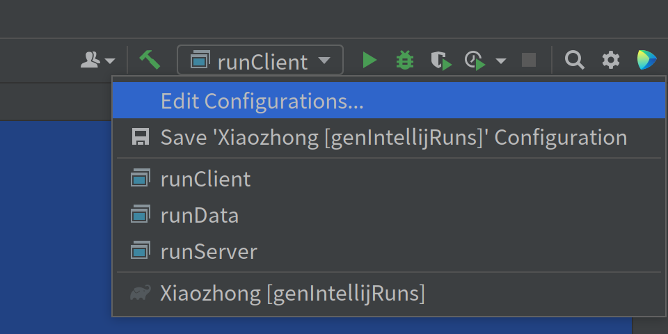

# 准备工作

除去必要的硬件条件外，读者需要从 <https://files.minecraftforge.net> 下载模组开发套件（Mod Development Kit，简称 MDK）。

?> 通常情况下，下载 MDK 仅需按下带有「MDK」的按钮，等待广告结束后点击跳过即可。如果加载广告有困难，可以点击「Show all Versions」，选择合适的版本，并把鼠标悬停在「MDK」右侧的图标上，那里会显示一个带有直链的悬浮窗。

如果你下载的是形如 `forge-1.18.1-39.0.66-mdk.zip` 的完整文件，那么恭喜你，下载成功了：找个合适的地方解压这个压缩包吧。

## 模组 ID

除去一个帅气的模组名称外，每个模组都需要一个全局唯一的模组 ID。

!> 模组 ID 应当仅由数字（`0-9`）、小写字母（`a-z`）、和下划线（`_`）组成，且尽量避免冲突：`industrialcraft2` 或者 `industrial_craft_2` 作为模组 ID 看起来就比 `ic2` 好很多（当然，如果你是 `ic2` 的作者，那当我没说）。

本篇指南的模组 ID 统一使用 `xiaozhong`。

## 配置文件

Forge MDK 的配置文件是 `build.gradle`。对 Gradle 熟悉的读者应该注意到了这是 Gradle 的核心配置文件。

?> 如欲进一步了解 Gradle，可参阅 [Gradle 官方用户指南](https://docs.gradle.org/current/userguide/userguide.html)。

主要需要修改的地方有三处。需要修改的第一处在 `build.gradle` 相对靠前的位置，和模组的发布有关：

```groovy
version = '1.0.0' // 模组版本号
group = 'org.teaconmc' // 模组的 Maven 组名，通常和包名相同
archivesBaseName = 'Xiaozhong' // 最后生成的模组文件名前缀（这里将会生成 Xiaozhong-1.0.0.jar）
```

需要修改的第二处在 `minecraft {}` 块下的 `run {}` 块内，约定了启动选项和所使用的[映射表](https://minecraft.fandom.com/zh/wiki/%E6%B7%B7%E6%B7%86%E6%98%A0%E5%B0%84%E8%A1%A8)：

```groovy
minecraft {
    // MDK 所使用的映射表，默认为 1.18.1 的 official 即官方映射表，由微软官方提供
    mappings channel: 'official', version: '1.18.1'
    // 以下为启动选项
    runs {
        // 玩家客户端
        client {
            workingDirectory project.file('run')
            property 'forge.logging.markers', 'REGISTRIES'
            property 'forge.logging.console.level', 'debug'
            mods {
                xiaozhong { // 修改一：此处需要更改为模组 ID
                    source sourceSets.main
                }
            }
        }
        // 专用服务端
        server {
            workingDirectory project.file('run')
            property 'forge.logging.markers', 'REGISTRIES'
            property 'forge.logging.console.level', 'debug'
            mods {
                examplemod { // 修改二：此处需要更改为模组 ID
                    source sourceSets.main
                }
            }
        }
        // Data Generator
        data {
            workingDirectory project.file('run')
            property 'forge.logging.markers', 'REGISTRIES'
            property 'forge.logging.console.level', 'debug'
            args '--mod', 'xiaozhong' /* 修改三：此处需要更改为模组 ID */, '--all', '--output', file('src/generated/resources/'), '--existing', file('src/main/resources/')
            mods {
                examplemod { // 修改四：此处需要更改为模组 ID
                    source sourceSets.main
                }
            }
        }
    }
}
```

?> Minecraft 官方对源代码编译后进行了混淆，因此为还原方法名、字段名、类名、以及包名以方便模组开发，Forge MDK 需要参照一个映射表。官方映射表未包含变量名的相关数据，而一个名叫「Parchment」的项目正好填补了这一空白。如欲使用「Parchment」映射表，请参阅 [Parchment 官方文档](https://github.com/ParchmentMC/Librarian/blob/dev/docs/FORGEGRADLE.md)。

需要修改的第三处在 `jar {}` 块内，约定了 JAR 的版本信息：

```groovy
jar {
    manifest {
        attributes([
                // Specification 信息
                "Specification-Title"     : "Xiaozhong",
                "Specification-Vendor"    : "TeaConMC",
                "Specification-Version"   : "1",
                // Implementation 信息
                "Implementation-Title"    : project.name,
                "Implementation-Version"  : project.jar.archiveVersion,
                "Implementation-Vendor"   : "TeaConMC",
                "Implementation-Timestamp": new Date().format("yyyy-MM-dd'T'HH:mm:ssZ")
        ])
    }
}
```

?> JAR 的版本信息分为 `Specification` 和 `Implementation` 两部分，具体可参见 [Oracle 官方提供的文档]( https://docs.oracle.com/javase/tutorial/deployment/jar/packageman.html)。

配置文件修改完成后，将 `build.gradle` 所在目录使用文本编辑器或 IDE 打开，等待进度条加载完成即可。

?> Forge 官方倾向于支持的开发工具有：Eclipse、IntelliJ IDEA、和 Visual Studio Code。我们鼓励使用 IntelliJ IDEA（<https://www.jetbrains.com/idea/>）作为开发工具。

!> 文本编辑器或 IDE 会自动完成全部配置（对 IntelliJ IDEA 而言进度会在 Build 侧边栏显示），但如果网络环境欠佳，配置进度将会十分缓慢，甚至可能出错。如果反复尝试均无法配置成功，可尝试删除**用户根目录**的 `.gradle` 目录重试。

## MDK 任务

Gradle 是一个基于任务的项目管理系统。通过 Forge MDK 我们可以执行许多不同的 Gradle 任务：

* `clean`：清理和 Forge MDK 有关的自动生成的部分文件。
* `build`：生成模组文件（生成的文件可在 `build/libs` 找到，可用于发布）。
* `genEclipseRuns`：生成针对 Eclipse 的 Minecraft 专用服务端 / 玩家客户端 / Data Generator 启动选项。
* `genIntellijRuns`：生成针对 IntelliJ IDEA 的 Minecraft 专用服务端 / 玩家客户端  / Data Generator 启动选项。
* `genVSCodeRuns`：生成针对 Visual Studio Code 的 Minecraft 专用服务端 / 玩家客户端  / Data Generator 启动选项。

?> Data Generator 是 Minecraft 原版的一种机制，可用于自动生成资源文件。我们稍后会用到这一机制。

常见的开发工具均深度集成了 Gradle 的支持（或有对应的插件），无论是执行 Gradle 任务还是启动乃至调试游戏均可在开发工具内部进行。

?> IntelliJ IDEA 用户可打开 Gradle 侧边栏，并在 `Tasks` 下找到上述任务并双击执行。在 IntelliJ IDEA 执行 `genIntellijRuns` 任务后，右上角会出现三个启动选项，分别是 `runClient`（启动专用服务端）、`runServer`（启动玩家客户端）、和 `runData`（启动 Data Generator）。<br><br>

